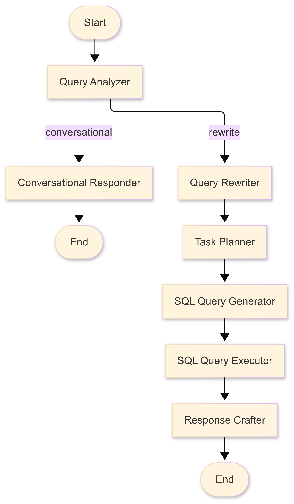

# **Financial Agent**
A multi-agent financial system that answers user queries with their financial transactions.

**Main Model :- **gpt-4o-mini**

---

<div style="text-align:center;">
    <h2>Agents Architecture</h2>
    
</div>

---

## **Prerequisites**
Ensure you have [Docker Desktop](https://www.docker.com/products/docker-desktop/) installed on your machine. 

---

## **Project Setup**
Follow these steps to set up the environment for this project

### **1. Create a `.env` file and define the following variables:**
```ini
OPENAI_API_KEY=your_openai_api_key
```

---

### **2. Build and Start the Docker Container**
- For *Windows*, use PowerShell
- Ensure you are in the root directory before executing the following command:
```bash
docker-compose up --build -d
```

---

### **3. Clear builder cache after installation**
After successful installation, you can clear Docker builder cache to free up space:
```bash
docker builder prune
```

---